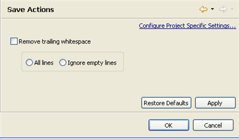

# Save Actions Preferences

<!--context:save_actions_preferences-->

The Save Actions Preferences page lets you remove trailing whitespace from a file each time you save it.

The Save Actions Preferences page is accessed from Window | Preferences | PHP | Editor | Save Actions .

<!--ref-start-->

To configure Save Actions:

 1. Mark the 'remove trailing whitespace' checkbox to enable the removal of whitespace after every save.
 2. Select whether All whitespace lines will be removed (by marking 'All lines'), or whether empty lines will be ignored (by marking 'Ignore empty lines).
 3. Click Apply to Apply your settings.

Every time you save a file, whitespace will be removed according to the configured settings.

<!--ref-end-->

<!--ref-start-->

To apply Save Actions settings to a specific project only:

 1. Click the link labelled "Configure Project Specific Settings".
 2. Select the required project from the list.  A Save Actions Properties page will appear.
 3. Select the required settings and click Apply.

<!--note-start-->

#### Note:

Save Action settings can also be configured for an existing project by right-clicking the project in Project Explorer view and selecting **Properties | Save Actions**.

<!--note-end-->

<!--ref-end-->

<!--links-start-->

#### Related Links:

 * [Formatter Preferences](../../../032-reference/032-preferences/024-code_style_preferences/016-formatter.md)
 * [PHP Preferences](../../../032-reference/032-preferences/000-index.md)
 * [Editor Preferences](000-index.md)

<!--links-end-->
