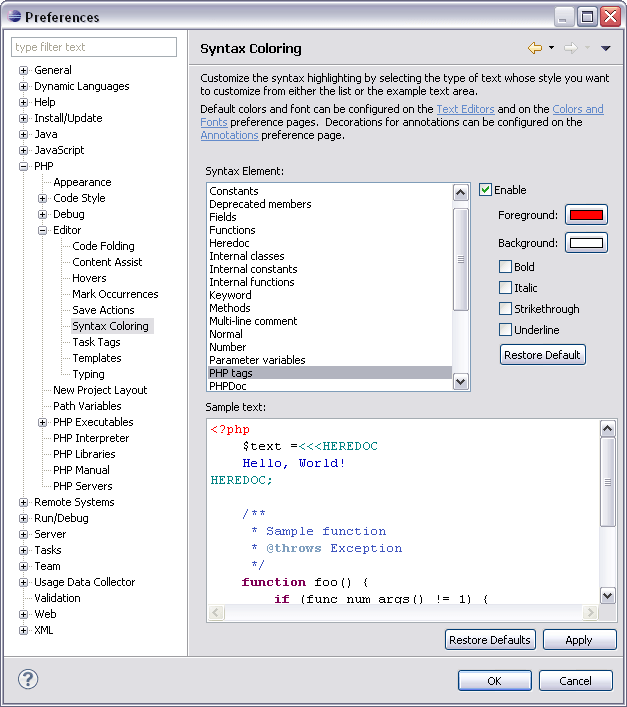

# Syntax Coloring Preferences

<!--context:syntax_coloring_preferences-->

The Syntax Coloring preferences page allows you to set the foreground color, background color and font type for different icons, in order to make your script manageable and easier to read.

The Syntax Coloring Preferences Preferences page is accessed from **Window | Preferences | PHP | Editor | Syntax Coloring Preferences**.

<!--ref-start-->

To configure the colors and fonts for an item:

 1. Select the required item from the Syntax element list.
 2. Click on **Foreground** or **Background**to select a color.
 3. Select what formatting, if any, you would like to apply to the text (Bold, Italic, Strikethrough, Underline)
 4. Click **Apply**and **OK**to apply and save your settings.

The Sample text box displays a preview of the different elements.

<!--ref-end-->

More color and font options can be configured by opening the preferences page, accessed from **Window | Preferences**, and selecting:

 * General | Appearance | Colors and Fonts
 * General | Editors | Text Editors | Annotation
 * General | Editors | Text Editors | Quick Diff
 * Run / Debug
 * Run / Debug | Console
 * Team | CVS | Console

<!--links-start-->

#### Related Links:

 * [Syntax Coloring](../../../016-concepts/024-syntax_highlighting.md)
 * [Formatter Preferences](../../../032-reference/032-preferences/024-code_style_preferences/016-formatter.md)
 * [PHP Preferences](../../../032-reference/032-preferences/000-index.md)
 * [Editor Preferences](000-index.md)

<!--links-end-->
