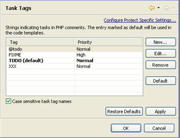

# Task TagsPreferences

<!--context:task_tags_preferences-->

The Task Tags preferences page allows you to add new task tags and edit existing ones. Tasks are used as reminders of actions, work to do or any other action required by the programmer. Task tags are strings used by PDT to recognize when tasks are added in your script. Anything after these strings inside a comment will be recognized as a task.

See the ' [Tasks view](PLUGINS_ROOT/org.eclipse.platform.doc.user/concepts/ctskview.htm)  ' topic in the  Workbench User Guide for more information on using tasks.

<!--note-start-->

#### Note:

Additional user guides can be accessed from inside PDT by going to **Help | Help Contents**, or from the Eclipse Online Documentation site ([http://help.eclipse.org/luna/index.jsp](http://help.eclipse.org/luna/index.jsp)).

<!--note-end-->

The Task Tags Preferences page is accessed from Window | Preferences | PHP | Editor | Task Tags .

Four common strings are included in the list by default.

<!--ref-start-->

To add a new Task Tag:

 1. Click New.
 2. Enter a tag name and priority (High/Normal/Low). Tags may contain any character string.
 3. Click OK.
 4. Click Apply to apply your settings.

The new tag will be added to the list and will trigger a task when inserted in the editor.

<!--ref-end-->

<!--ref-start-->

To edit a tag:

 1. Double click the tag -or- select it and click Edit.
 2. Edit the tag name or priority.
 3. Click OK.
 4. Click Apply to apply your settings.

<!--ref-end-->

Selecting a tag and clicking Default will set the task tag as the default one to be used in Code templates. See the [Templates Preferences](064-templates.md) topic for more on template preferences.

<!--note-start-->

#### Note:

If the 'case sensitive task tag names' checkbox is marked, task tag names will be case sensitive.

<!--note-end-->

<!--ref-start-->

To apply Task Tags settings to a specific project only:

 1. Select the link labelled "Configure Project Specific Settings".
 2. Select the required project from the list.  A Task Tags Properties dialog will appear.
 3. Select the required settings and click Apply.  A prompt dialog will appear stating that a rebuild of the project must occur for the settings to take effect.
 4. Click Yes to rebuild the project  -Or- Click No for a rebuild to be performed only when PDT is restarted.  -Or - Click Cancel to cancel the operation.

<!--ref-end-->

<!--links-start-->

#### Related Links:

 * [PHP Preferences](../../../032-reference/032-preferences/000-index.md)
 * [Editor Preferences](000-index.md)

<!--links-end-->
