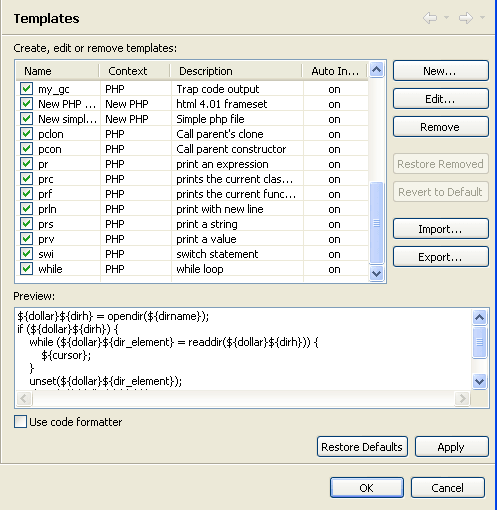
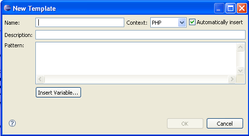

# Templates Preferences

<!--context:templates_preferences-->

The Templates Preferences page allows you to create, edit, delete, import and export templates.

Templates are shortcuts used to insert a pre-defined framework of code. The purpose is to save time and reduce the potential for errors in standard, repetitive code units. Once a template is inserted, you can complete the code quickly using manual and automated code entry methods.

To insert a template into your code, enter the first few letters of its name and press Ctrl+Space to activate the Content Assist function and open the content assist list. Select the required template from the list. Templates are marked with a  icon. For more on using the content assist function, see [Working with Content Assist](../../../008-getting_started/016-basic_tutorial/016-working_with_code_assist.md).

The Templates Preferences page is accessed from **Window | Preferences | PHP | Templates**.

To remove a template from the list of available options, unmark its checkbox in the list.

To edit an existing template, select it from the list and click Edit.

### Creatinga new Template

This procedure describes how to create a new template to be added to the template list.

<!--ref-start-->

To create a new template:

 1. Click New.
 2. The New Template dialog will open.

 3. Enter the template's details:
    * Name -  A short name to identify the template (e.g. 'while' for a template for a while loop).
    * Context -  The code context when the template will be available (PHP, PHPDoc, New PHP ). e.g. PHP templates will only be available for use when writing PHP code.
    * Description - A short description of the template's code.
    * Pattern - The pattern is the actual code string that will be inserted into the editor whenever this template is selected.  Use the Insert Variable button to select from a list of common variables.
 4. Click OK.

Your template will be added to the list and will be available from the Content Assist in the relevant context.

<!--ref-end-->

### Exporting and Importing Templates

PDT enables you to export and import Templates, created within XML files in the following format:

    <?xml version="1.0" encoding="UTF-8" ?>
    <templates>
    <template autoinsert="true" context="php" deleted="false" description="description" enabled="true" name="for">
    for($$i = 0; $$i < 1; $$i++){ }
    </template>

<!--ref-start-->

To import a template:

 1. Click Import to open the Import Template's browser.
 2. Select the location to import the relevant XML file containing the template information.
 3. Click Open.

The templates contained in the template.xml file will be imported into the list of Templates.

<!--ref-end-->

<!--ref-start-->

To export a template:

 1. Select the template(s) for export from the Template list.
 2. Click Export to open the Export Template's dialog.
 3. Select the location to save the XML file to.
 4. Click Save.

An XML file will be created with the template information.

<!--ref-end-->

<!--note-start-->

#### Note:

If you selected more than one template to export, all of them will be present in the exported XML file. Each of the original Templates is bounded by: &lt;template&gt; &lt;/template&gt;

<!--note-end-->

<!--links-start-->

#### Related Links:

 * [Using Templates](../../../024-tasks/032-using_templates.md)
 * [PHP Preferences](../../../032-reference/032-preferences/000-index.md)
 * [Content Assist](../../../016-concepts/016-code_assist_concept.md)

<!--links-end-->
