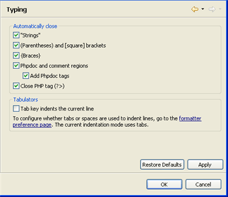

# Typing Preferences

<!--context:typing_preferences-->

The Typing preferences page allows you to configure the code and language patterns that PDT will automatically complete, and whether the tab key will indent the current line.

The Typing Preferences page is accessed from Window | Preferences | PHP | Editor | Typing .

Automatically Close

PDT can be set to automatically complete the following types of patterns:

 * "Strings" - A pair of double quotes ("") will be inserted when a single quotation mark (") is entered.
 * (Parentheses) and [Square] brackets - A pair of brackets will be inserted when the opening bracket is entered.
 * {Braces} - A pair of braces will be inserted when the opening brace is entered.
 * PhpDoc and comment regions - Automatically creates [phpDoc Blocks](../../../016-concepts/064-commenting_code/008-phpdoc_comments.md)
 * Add phpDoc tags - Adds phpDoc tags within the phpDoc Block comment.
 * Close PHP tag - A closing PHP tag (?>) will be inserted when the opening PHP tag (<?php) is entered.

<!--ref-start-->

To configure your 'automatic close' options:

 1. Mark the checkboxes of the patterns you would like PDT to auto-complete.
 2. Click Apply to apply your settings.

To use the auto-complete function, type the opening character in the editor. The matching character will be automatically inserted.

<!--ref-end-->

Tabulators

<!--ref-start-->

To be able to indent a selected line in the editor using the Tab Key:

 1. Mark the 'tab key indents the current line' checkbox.
 2. Click Apply to apply your settings.

For more on indentation preferences, see the [Formatter](../../../032-reference/032-preferences/024-code_style_preferences/016-formatter.md) Preferences page.

<!--ref-end-->

<!--links-start-->

#### Related Links:

 * [Automatic Completion](../../../016-concepts/032-automatic_insertion.md)
 * [PHP Preferences](../../../032-reference/032-preferences/000-index.md)
 * [Editor Preferences](000-index.md)
 * [phpDoc Block Comments](../../../016-concepts/064-commenting_code/008-phpdoc_comments.md)

<!--links-end-->
