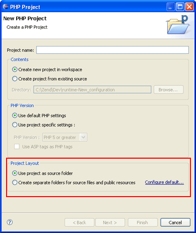
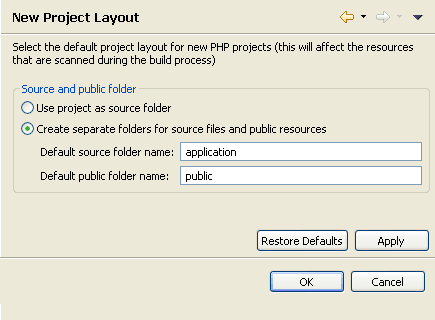

# New Project Layout Preferences

<!--context:new_project_layout_preferences-->

The New Project Layout Preferences page allows you to configure the default layout for new PHP projects. The default layout will configure whether all folders under the project root will be considered as 'source' folders for the [Build process](../../016-concepts/152-build_paths.md), or whether separate folders will be created for resources which are included or excluded from the Build process.

The preferences configured in the New Project Layout Preferences page will affect the default option selected in the Project Layout category of the New PHP Project wizard. This setting can be modified per project during creation.

The New Project Layout Preferences page is accessed from Window | Preferences | PHP | New Project Layout Preferences .

<!--ref-start-->

To configure the default New PHP Project Layout:

Select the required option:

 * Use project as source folder - By default, all folders created under the project root will be considered 'source folders' and will be scanned during the Build process.  See [Configuring a Project's PHP Build Path](../../024-tasks/176-configuring_build_paths.md) to configure the project's PHP Build Path.
 * Create separate folders for source files and public resources - Two folders will be created under your project root - one 'source' folder for resources which will be scanned during the Build process and one 'public' folder which will be skipped during the Build process.  You can change the default names for these folders by entering the required name in the 'Default source/public folder name' fields.

<!--ref-end-->

<!--links-start-->

#### Related Links:

 * [PHP Preferences](000-index.md)
 * [PHP Build Path](../../016-concepts/152-build_paths.md)
 * [Configuring a Project's PHP Build Path](../../024-tasks/176-configuring_build_paths.md)
 
<!--links-end-->
