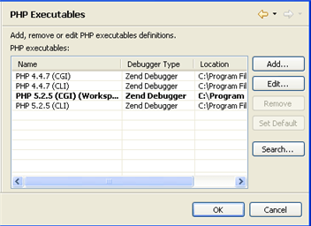
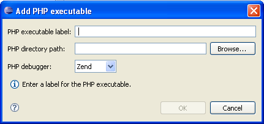

# PHP Executables Preferences

<!--context:php_executables--><!--context:php_executables_preferences-->

The PHP Executables Preferences page allows you to add, edit, remove and find PHP Executables.

The internal debugger in the defined PHP Executable is used for [local PHP Script debugging](../../024-tasks/152-debugging/024-locally_debugging_a_php_script.md).

<!--note-start-->

#### Note:

You must configure a PHP Executable before you can debug locally.

<!--note-end-->

The PHP Executables Preferences Preferences page is accessed from Window | Preferences | PHP | PHP Executables Preferences .

<!--ref-start-->

To add a PHP executable to the list:

 1. Click Add.  The Add PHP Executable dialog will appear.

 2. Enter a name for the PHP Executable.
 3. In the Executable path selection, enter the location of the PHP executable on your file system.
 4. Select the PHP ini file to be associated with the PHP Executable by clicking Browse (optional).
 5. Select the PHP Debugger to be used with the executable. By default this will be the Zend Debugger.
 6. Click Finish.

The PHP executable will be added to your list.

<!--ref-end-->

<!--ref-start-->

To search for a PHP executable on your local file system:

 1. Click Search.
 2. In the Directory Selection dialog, select the folder to search.
 3. Click OK. PDT will search for PHP executables in the location specified.

Any found PHP executables will be added to the list.

To change the name of the new PHP executable, select it from the list and click Edit.

If a PHP executable is not found in the specified directory, select a different location or add the PHP Executable manually by following the instructions under '[To add a PHP executable to the list](#add-executable)', above.

<!--ref-end-->

<!--links-start-->

#### Related Links:

 * [PHP Support](../../016-concepts/008-php_support.md)
 * [PHP Interpreter Preferences](064-php_interpreter.md)

<!--links-end-->
