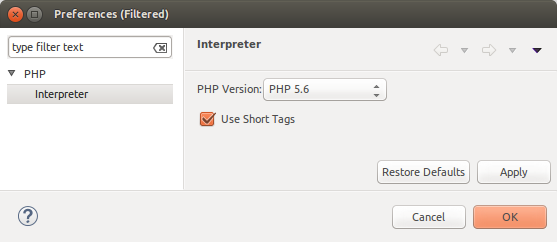

# PHP InterpreterPreferences

<!--context:php_interpreter_preferences-->

The PHP Interpreter preferences page allows you to set which PHP version to use for the project. This will affect the internal debugger, code analyzer and content assist.

The PHP Interpreter Preferences page is accessed from Window | Preferences | PHP | PHP Interpreter .

<!--ref-start-->

To configure your PHP version:

 1. Select the PHP Version to use. The default options are PHP 4 or PHP 5 or greater.  See [PHP Support](../../016-concepts/008-php_support.md) for more on effects the PHP version settings have.
 2. Mark the "Use ASP tags as PHP tags" checkbox in order for Code Completion to respond to ASP tags in the same way as it responds to PHP tags.
 3. Click OK to apply your settings.

<!--ref-end-->

<!--ref-start-->

To use a different PHP Interpreter for a specific project:

 1. Select the link labelled "Configure Project Specific Settings".
 2. Select the specific project from the list.
 3. Another PHP Interpreter preferences page will open  
 4. Mark the Enable project specific settings checkbox.
 5. Choose your PHP version.
 6. Click Apply.
 7. A prompt dialog will appear stating that a rebuild of the project must occur for the settings to take effect.
 8. Click Yes to rebuild the project. Error parsing will be performed according to the PHP version chosen.  If you click No, the rebuild will be performed the next time it is restarted.

<!--ref-end-->

<!--links-start-->

#### Related Links:

 * [PHP Support](../../016-concepts/008-php_support.md)
 * [PHP Executables Preferences](056-php_executables.md)
 * [PHP Preferences](000-index.md)

<!--links-end-->
