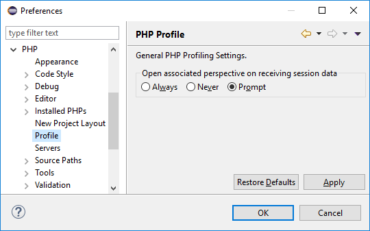

# Profile Preferences

<!--context:profile_preferences-->

The **PHP Profile** preferences page allows you to configure default settings for the profiling process.

The profiling preferences page is accessed from **Window | Preferences | PHP | Profile** preferences page.

The settings that can be configured from the profile preferences page are:
 * **Open associated perspective on receiving session data** - Choose if PHP Profile perspective should be opened on receiving profile session data.

<!--links-start-->

#### Related Links:

 * [Profiling](../../../024-tasks/216-profiling/000-index.md)
 * [Code Coverage Preferences](../096-code_coverage.md)
 * [PHP Preferences](../../../032-reference/032-preferences/000-index.md)

<!--links-end-->
