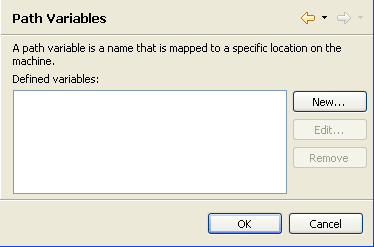

# Path Variables Preferences

<!--context:path_variables_preferences-->

The Path Variables preferences page displays a list of your configured 
 path variables and allows you to add or edit them.
 

A path variable is a name that is mapped to a specific location on the 
 machine. 

By using a path variable, you can share projects containing linked resources 
 with team members without requiring the same directory structure as on 
 your file system.

Include path variables can also be added to a project's include path. 

The Path Variables 
 Preferences page is accessed from Window | Preferences | PHP | Path Variables.

<!--ref-start-->

 1. To add a new path variable:
 2. Click New.
 3. Enter the name of the path.
 4. Enter the location to which the path should point. 
 5. Click OK.
 6. The Path Variable will be added to the list.
 7. Click OK to apply your settings.

<!--ref-end-->

<!--links-start-->

#### Related Links:

 * [PHP Preferences](000-index.md)

<!--links-end-->

