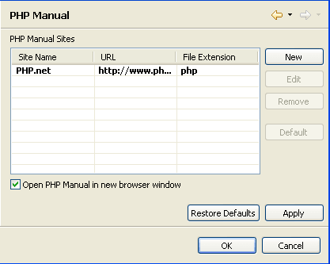

# PHP Manual Preferences

<!--context:php_manual_preferences-->

The PHP Manual preferences page sets the location of sites which allow you to access and view the PHP Manual and allows you to add, edit or remove sites.

The PHP Manual contains an explanation of PHP functions. PHP Manuals can be accessed online or locally from within PDT in order to provide an immediate explanation of the functionality and proper use of all PHP functions.

The PHP Manual Preferences Preferences page is accessed from Window | Preferences | PHP | PHP Manual Preferences .

<!--ref-start-->

To add additional sites to the list:

 1. Click New.
 2. Enter the Name of a site allowing access to the PHP Manual and its URL, Local Directory location or Windows CHM File location.
 3. Choose whether its file extension is php, htm or html.
 4. Click OK. Your new site will be added to the list.

See the [PHP Manual Integration](../../016-concepts/104-php_manual_integration.md) topic for more information.

<!--ref-end-->

Mark the 'Open PHP Manual in new browser window' checkbox to select that each request to open the manual will appear in a new browser tab of the Editor.

<!--note-start-->

#### Note:

The initial, default site cannot be removed or edited.

<!--note-end-->

Click OK to apply your settings.

<!--links-start-->

#### Related Links:

 * [PHP Manual Integration](../../016-concepts/104-php_manual_integration.md)
 * [PHP Preferences](000-index.md)

<!--links-end-->
