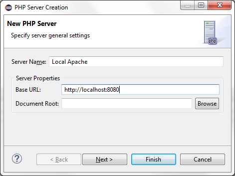

# PHP Servers Preferences

<!--context:php_servers_preferences-->

The PHP Servers Preferences page will display a list of your currently configured servers and allow you to add servers or edit settings for existing servers. The server settings will be used for debugging/profiling files on a remote server.

The PHP Servers Preferences page is accessed from **Window | Preferences | PHP | PHP Servers**.

One server configuration setting is configured by default and will point to the URL http://localhost.

<!--ref-start-->

To add a new server to the list or edit an existing server configuration:

 1. Click New  -Or- select an existing server and click Edit.

 2. Enter the name of your server.
 3. Enter the URL that points to its document root.
 4. Click Next. The Debugger settings page should appear.

 5. If there is a need, change the default debugger type and connection settings.
 6. Click Next. The Server Path Mapping page should appear.
 7. If you would like to map a path on your server to a local path, click Add and enter:
    * The path on your server.
    * The path you would like to map it to in your Workspace or on your File System.  See [Adding a Server Location Path Map](../../024-tasks/184-adding_a_server_path_map.md) for more information.
 8. Click Finish.

Your new server configuration will be added to the server list.

<!--ref-end-->

<!--links-start-->

#### Related Links:

 * [Debugging](../../024-tasks/152-debugging/000-index.md)
 * [Debugging a PHP Web Page](../../024-tasks/152-debugging/032-debugging_a_php_web_page.md)
 * [PHP Preferences](000-index.md)

<!--links-end-->
