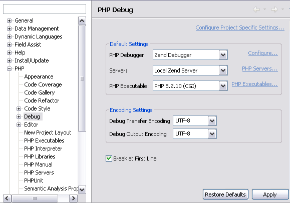

# Configuring Tunneling Debug Preferences

<!--context:configuring_tunneling_debug_preferences-->

Before initiating a debug session using tunneling, you must ensure the correct port numbers are configured in the Debug Preferences page.

This procedure describes how to configure your Debug preferences to enable tunneling.

<!--ref-start-->

To configure Debug Settings for PDT :

 1. Open the PHP Debug Preferences page by going to  **Window | Preferences | PHP | Debug**.  
 2. In the "Debug Options" section, ensure the following default settings are configured:
    * The Zend Debugger port number must be 10137.
    * In the "Advanced Zend Debugger Options" category, the Broadcast Port must be set to 20080.
    * In the Client Host/IP category, enter the Client Host/IP to which debugging results will be returned. PDT will automatically search for and recognize the Client Host/IP, but entering a specific Host/IP will speed up the debugging process and decrease the likelihood of session time-outs.

<!--ref-end-->

The next step in creating a tunneling connection is to [Set your Environment to be an Allowed Host](../../024-tasks/152-debugging/048-troubleshooting_remote_debugging/008-setting_your_zend_studio_for_eclipse_to_be_an_allowed_host.md).

<!--links-start-->

#### Related Links:

 * [Setting your Environment for Eclipse to be an Allowed Host](../../024-tasks/152-debugging/048-troubleshooting_remote_debugging/008-setting_your_zend_studio_for_eclipse_to_be_an_allowed_host.md)

<!--links-end-->
