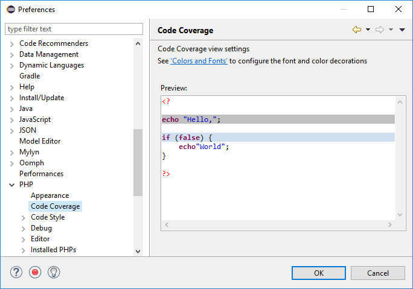
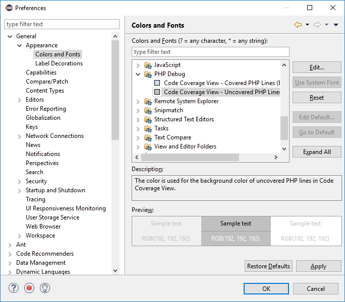

# Code Coverage Preferences

<!--context:code_coverage_preferences-->

The Code Coverage Preferences page displays a preview of code in Code Coverage view, with the current color and font settings. Code coverage views are displayed when using various features such as profiling, unit testing and debugging to show which lines of code have been covered by this functionality.

The Code Coverage Preferences page is accessed from Window | Preferences | PHP | Code Coverage

To configure code coverage colors and fonts:
1. Click the 'Colors and Fonts' link. The Colors and Fonts preferences page will be displayed, with the PHP Debug category open.

.
2. Select the required background color for covered lines and uncovered lines by selecting the relevant option and clicking the required color in the color selection box (top-right corner).
3. Click Apply.
4. The changes will be displayed in the Code Coverage preview page.

<!--links-start-->

#### Related Links:

 * [PHP Preferences](000-index.md)
 * [Code Coverage Summary View](../008-php_perspectives_and_views/032-php_profile_perspective/040-code_coverage_summary_view.md)
 * [Code Coverage View](../008-php_perspectives_and_views/032-php_profile_perspective/040-code_coverage_view.md)

<!--links-end-->
