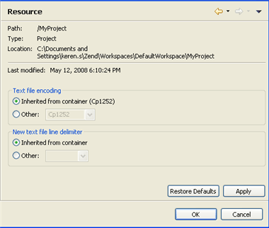

# Resource Properties

<!--context:resource_properties-->

The Resource Properties page displays information about your project and allows you to set the project's text file encoding and line delimeters.

To access the Resource Properties page, right-click a PHP project in Project Explorer view and select Properties | Resource -or- select the project and from the menu bar go to Project | Properties | Resource.

The following information is displayed in the Resource Properties page:

 * **Path**: For PHP Projects, this will be the project's name. If a file inside a project was selected, this would display the file's location within the project.
 * **Type**: For PHP Projects, this will be 'Project'.
 * **Location**: The project's location on the file system.

<!--ref-start-->

To configure PHP project resource properties:

1\. Select options for:

 * Text File encoding:By default, this will be inherited from the container (this will be determined according to your local settings).  If your text files use a different encoding scheme (because, for example, they originated from an external source), you can change the encoding by selecting the 'Other' option and choosing the required encoding from the drop-down list.
 * New text file line delimiter:This will define the line delimiter for new text files. Select to inherit from container or select 'Other' and choose the required option from the drop-down list.

<!--note-start-->

#### Note:

These settings can be configured for all newly created projects through the Workspace preferences page (Window | Preferences | General | Workspace).

<!--note-end-->

2\. Click Apply to apply your settings.

<!--ref-end-->

<!--links-start-->

#### Related Links:

 * [Builders Properties](016-builders_properties.md)
 * [Formatter Properties](../../032-reference/040-php_project_properties/024-code_style_properties/016-formatter_properties.md)
 * [PHP Debug Properties](040-php_debug_properties.md)
 * [PHP Include Path Properties](048-php_include_path_properties.md)
 * [PHP Interpreter Properties](056-php_interpreter_properties.md)
 * [PHP Task Tags Properties](064-php_task_tags_properties.md)

<!--links-end-->
