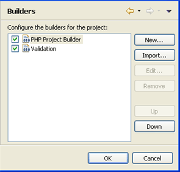

# Builders Properties

<!--context:builders_properties-->

The Builders Properties page allows you to configure the External Tool builders that are run when this project is built and add, remove, or reorder external tools in the build order.  The Eclipse build process scans external resources which are referenced in a project so that their contents can be made available for operations such as Content Assist and Refactoring.

To access the Builders Properties page, right-click a PHP project in Project Explorer view and select Properties | Resource -or- select the project and from the menu bar go to Project | Properties | Builders Properties .

By default, Builders will be added according to the type of resources in your projects (e.g. if you add JavaScript libraries the JavaScript builder will be added.).

However, you can also configure your own external builders, if required.

<!--ref-start-->

To add a new Builder:

 1. Click New.  The Choose Configuration Type wizard is displayed.
 2. Select the required Builder type and click OK.
 3. A wizard will be displayed allowing you to configure your Builder.  See the [External Tools](PLUGINS_ROOT/org.eclipse.platform.doc.user/concepts/concepts-exttools.htm)  topic in the Workbench User Guide for information on configuring your Builder.

<!--note-start-->

#### Note:

Additional user guides can be accessed from inside PDT by going to **Help | Help Contents**, or from the Eclipse Online Documentation site ([http://help.eclipse.org/luna/index.jsp](http://help.eclipse.org/luna/index.jsp)).

<!--note-end-->

Click OK to apply your settings.

<!--ref-end-->

<!--links-start-->

#### Related Links:

 * [Formatter Properties](../../032-reference/040-php_project_properties/024-code_style_properties/016-formatter_properties.md)
 * [PHP Debug Properties](040-php_debug_properties.md)
 * [PHP Include Path Properties](048-php_include_path_properties.md)
 * [PHP Interpreter Properties](056-php_interpreter_properties.md)
 * [PHP Task Tags Properties](064-php_task_tags_properties.md)

<!--links-end-->
