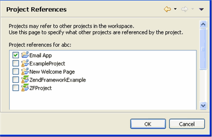

# Project References Properties

<!--context:project_references_properties-->

The Project References Properties page allows you to set the projects which are referenced by your project. This affects actions such as opening and closing of projects. (i.e. if you close a project and re-open it, you will be prompted to also open the projects which it references.)

To access the Project References Properties page, right-click a PHP project in Project Explorer view and select Properties | Resource -or- select the project and from the menu bar go to Project | Properties | Project References Properties .

<!--ref-start-->

To set the projects referenced by your project:

 1. Mark the checkbox of the projects that are referenced within your project.
 2. Click OK.

The selected projects are now specified as referenced by your project.

<!--ref-end-->

<!--links-start-->

#### Related Links:

 * [Include Paths](../../016-concepts/144-include_paths.md)
 * [PHP Task Tags Properties](064-php_task_tags_properties.md)
 * [Save Actions Properties](096-editor/008-save_actions_properties.md)

<!--links-end-->
