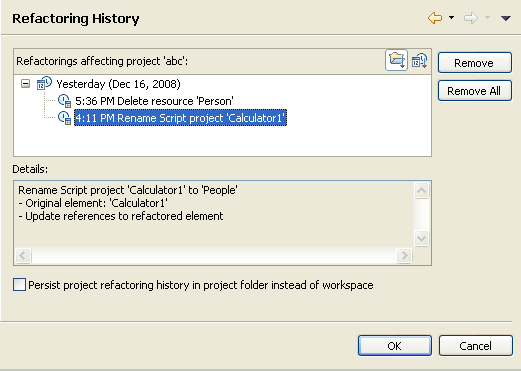

# Refactoring History

<!--context:refactoring_history-->

The Refactoring History Properties page allows you to view all refactoring operations that have been performed on the project.

To access the Resource Properties page, right-click a PHP project in PHP Explorer view and select Properties | Refactoring History -or- select the project and from the menu bar go to Project | Properties | Refactoring History.

<!--links-start-->

#### Related Links:

 * [PHP Project Properties](000-index.md)
 * [PHP Preferences](../../032-reference/032-preferences/000-index.md)

<!--links-end-->
