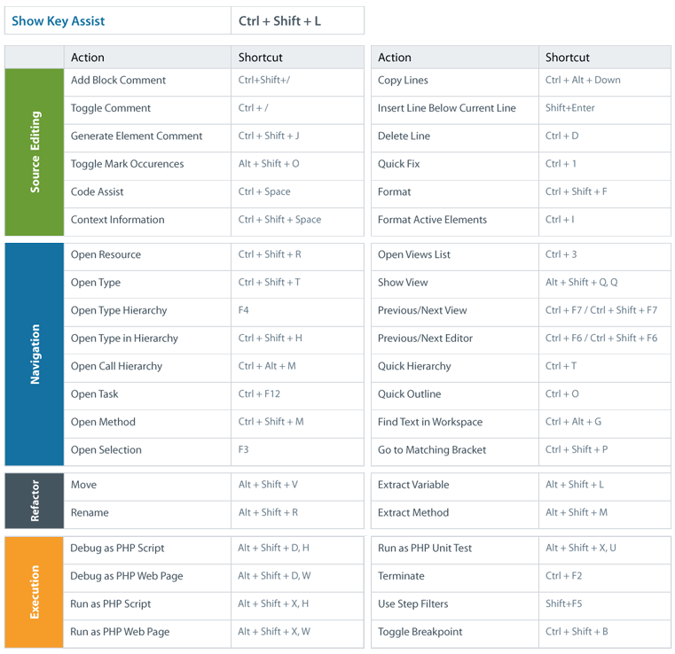

# Keymap

<!--context:keymap--><!--context:phpexe_env_preferences--><!--context:pharpackager_wizard_page--><!--context:phar_file_import_wizard_page-->

The following table displays a list of commonly used keyboard shortcuts which can be printed for quick access.

To see a full list of shortcuts and to configure the keymap, go to  [Window | Preferences | General | Keys.](javascript:executeCommand&lpar&'org.eclipse.ui.window.preferences&lpar;preferencePageId=org.eclipse.ui.preferencePages.Keys&rpar;&rpar;) To bring up a list of commonly used commands, press Ctrl+Shift+L in the Editor.

<!--links-start-->

#### Related Links:

 * [Reference](000-index.md)

<!--links-end-->
